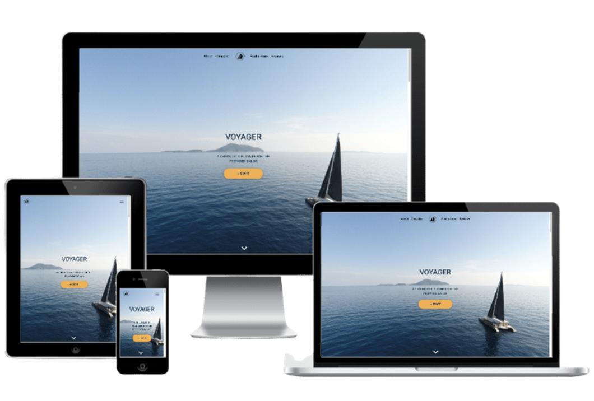
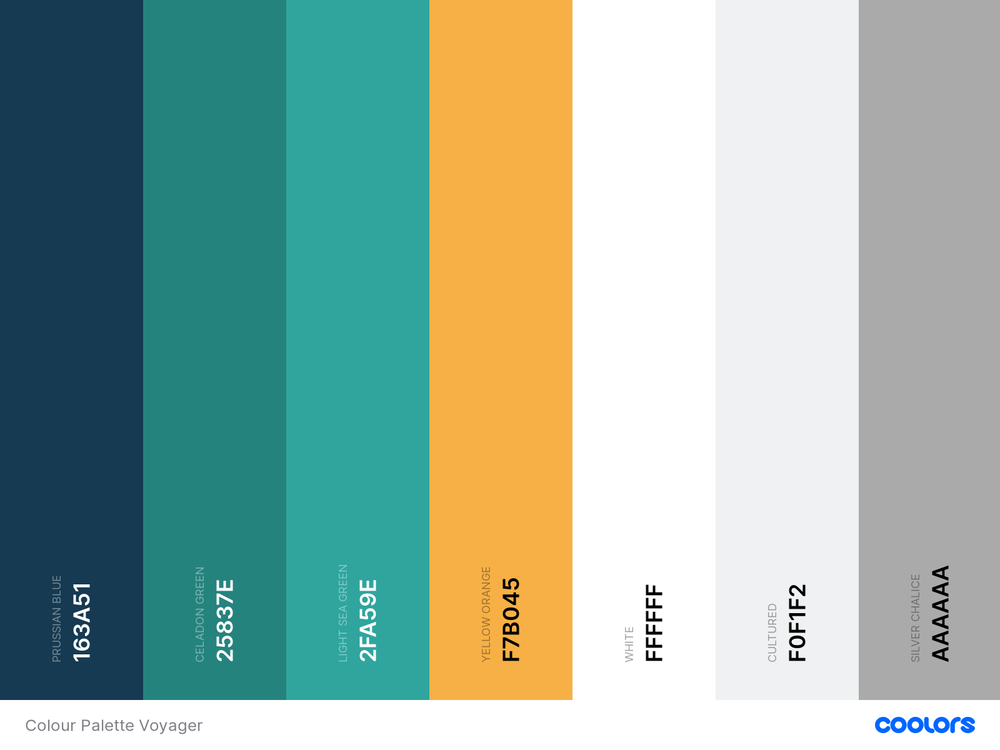
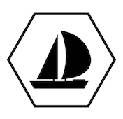

# **Voyager**

[View live version of website via GitHub Pages](https://franciskadtt.github.io/voyager/)

A sailing voyage needs some planning even for an experienced sailor. Voyager is a checklist for Sailors to pack & plan before they set off on an overnight voyage. 

## **Goal for this project** 
- To be a guideline for sailors so they can know what items to pack on a sailing overnight voyage.
- To be a checklist for sailors that is customisable. 
- To be a tool that can show sailors the items to buy.
- To help people find a sailing store either online or physical store, to purchase the things they need for their voyage.

## Table of contents 
* [UX](#ux)
    * [User Persona](#user-persona)
    * [Who](#who)
    * [User Goals](#user-goals) 
    * [Site Owners Goals](#site-owners-goals) 
    * [User Stories](#user-stories)
    * [User Requirements and Expectations](#user-requirements-and-expectations)
        * [Requirements](#requirements)
        * [Expectations](#expectations)
    * [Design](#design)
        * [Fonts](#fonts)
        * [Icons](#icons)
        * [Colours](#colours)
        * [Logo](#logo)
* [Wireframes](#wireframes)
* [Features](#features)
    * [Existing Features](#existing-features)
    * [Features to be implemented](#features-to-be-implemented)
* [Technologies used](#technologies-used)
    * [Languages](#languages)
    * [Tools and Libraries](#tools-and-libraries)
* [Testing](#testing)
* [Deployment](#deployment)
* [Credits](#credits)

## **UX**

### **User Persona**
This website is a tool for users interested in planning and pack for a day or an overnight sailing trip including beginner to intermediate sailors and people going on a sailing trip. The users want to use this tool as a guide on what to pack but also have a high level view on what needs to be done before they go on a voyage. The users are comfortable with using technology. 

### **Who**
Who are we building this website for?
- People planning a day or overnight sailing trip.

### **User Goals**
- Have a high level view of the what needs to be done and able to tick items off a list
- To see the items that needs to be packed or bought
- To see the items that are already packed
- To see the items that they need to buy
- Easily find information on sailing stores (online or physical stores)
- To trust the application by reading reviews from other users

### **Site Owners Goals**
- Be the “go to” planning and checklist tool for users going on a sailing voyage 
- Help users find sailing stores
- Gain insights from users what they need from the tool

### **User Stories**
* As a beginner to intermediate sailor, I want to have guidance on what to pack for a day/overnight trip.
* As a sailor, I want to make sure that I have remembered all the items to be packed by using a checklist
* As a user if I have packed an item on the list, I want to be able to check it off the list.
* As a sailor, I want to be able to list items I still need to buy 
* As a user if I have bought an item on the list, I want to be able to check it off the list.
* As a sailor, I want to be able to find a sailing store to buy items (either physical or online).
* As a user, I want to be able to see reviews from other users.
* As a user, I want to be able to share my own feedback regarding the checklist
* As a user, I want to be able to follow or connect with the creator of the site on social media

### **User Requirements and Expectations**

#### Requirements
* Easy to navigate by using the navigation menu.
* Relevant content in checklist for a sailing voyage.
* Appealing visual elements.
* Easy way to contact site owner for suggestions.

#### Expectations
* When clicking on links (store and social media links), expect the page to open in a seperate browser.
* Expect feedback when submitting the contact form that the form has been submitted correctly.
* Expect that the navigation links work properly to take the user where they intended to go to.
* Expect items to be move from one list to another (either packed or to buy)
* Clear map of physical stores.

### **Design**
As the central theme of the website is sailing, I made all my design choices based on nautical colours & elements.
I researched images and websites of boats, sailing and yachts to get inspiration for the colour scheme.

#### Fonts
I used [Google Fonts](https://fonts.google.com/ "Google Fonts") to explore the various options.
For the overall content I have decided to use the [Roboto](https://fonts.google.com/specimen/Roboto?preview.text_type=custom") Google fonts: Roboto") font. This font is modern and easily readable.

#### Icons
I used icons from [Font Awesome library](https://fontawesome.com/ "Font Awesome"). The icons that was used were are all nautical themed or used to give meaning to certain section.

#### Colours
The colour scheme is based on nautical and sailing colours. I wanted it to feel modern and clean. I used [Coolors](https://coolors.co/ "Coolors.co") to map out my colour scheme.

Colour Palette:

* #163A51: This dark blue colour is the primary colour for all headings and text. It is also the background of the main call to actions, check buttons and footer background.
* #F7B045: This is a yellow orange colour used as an accent colour inlcluding the start button, the buy buttons and the clear/reset button.
* #2FA59E: This is a sea green used minimally as a secondary colour for the icons in the About section.
* #F0F1F2: This is a off white/grey colour used for background blocks to break the website into sections. 
* #AAAAA: This is a light grey colour used for special icons. 

I used [Accessible Colors](https://accessible-colors.com/ "Accessible Colors") to make sure the colours in the design is at least AA compliant.

#### Logo
I designed the logo using an icon from [Canva](https://www.canva.com/ "Canva")

## **Wireframes**
I have used [Balsamic](https://balsamiq.com/wireframes/) to create low-fidelity wireframes and used [AdobeXD](https://www.adobe.com/ie/products/xd.html) to create medium-fidelity wireframes.
First I created a basic wireframe for mobile, for tablet and desktop. 
For my website I have decided to go for a 1 page website which suits more with the current trends. 
The website will be easy to navigate by using the navigation bar or by scrolling down the page. I have included a scroll-up button for user convenience. 

### Wireframe images:
#### Low Fidelity
- [Landing Page Section](assets/wireframes/landing_page.png)
- [About Section](assets/wireframes/about_section.png)
- [Checklist Section](assets/wireframes/checklist_section.png)
- [To Buy List Section](assets/wireframes/to_buy_list_section.png)
- [Find a Store Section](assets/wireframes/find_a_store_section.png)
- [Review Section](assets/wireframes/review section.png)

#### Medium Fidelity
- [Mobile & Tablet](assets/wireframes/mobile_tablet_mf-wireframe.png)
- [Desktop](assets/wireframes/desktop_mf-wireframe.png)

## **Features**
- One page site with 6 sections: Landing, About, Checklist, Find a Store, Reviews and Footer section
- There is a mobile-first focus and therefore I wanted to keep in mind first what will work on mobile. 

### Nav bar
1. Logo - if clicked/ tapped - return to Landing section
2. Mobile & Tablet - User can tap hamburger icon to open menu with above 6 sections
3. Desktop - Nav bar extended and user can see page sections.
4. Nav bar - If click/tap on Logo - go to Landing Section.
5. Nav bar - If click/tap on About - go to About Section.
6. Nav bar - If click/tap on Checklist - go to Checklist Section.
7. Nav bar - If click/tap on Find a Store - go to Find a Store Section.
8. Nav bar - If click/tap on Reviews - go to Reviews Section.
9. Nav bar - If click/tap on Footer - go to Footer Section.

### Landing Section
1. User can click/tap on start button to go directly to the Checklist section.
2. User can click/tap on chevron (downarrow) to go to About section.

### About Section
1. Paragraph giving some background about the website for the user.
2. Icons with summary of main features.

### Checklist Section
1. The user can enter the voyage name in the box.
2. The user can enter the departure point name in the box.
3. If user click/tap on “Show Me The Ropes” then a modal displays with instructions. In the Instructions box, there is a “X” which the user can tap to exit the modal and return to the main screen.
5. If user clicks/taps on the “Clear The Decks” button, then all the values are cleared below.
6. List of categories in a list. If the user click/tap category in list, list of items for that category will display below in “Items” list. If a category is not selected, the category items will be hidden.
7. List of items linked to a category will only display max 6 items. User can scroll down to view more items.
8. If the user click/tap on "check" button, the item moves to “Already Packed” list and is removed from items list.
9. Option where user can add own item in the box. If user click on garbage icon, item is removed.
10. If the user click/tap on "buy" button, the item moves to “To Buy” list. If user have packed it, they can select the "Check" button. The item moves to “Already Packed” list and is removed from items list.

### Find a store
1. List of links to online stores - if user click/tap on box - new page open with company website.
2. Display stores on Google Maps (API) with map markers.
3. If user click/taps on markers, store information displays.

### Reviews
1. Have a carousel with cards. Can click on arrows to toggle left or right.
2. Have a contact form where user can give feedback of website.
3. Success message if the feedback form submitted successfully.
4. Clear form if message submitted successfully.

### Footer
1. Social links - click/tap on social icons to open new page to social media pages.
 

### **Existing Features**
#### Header
- Logo - Allows the user to easily recognise the brand of “Voyage”. If the user clicks on the logo, it will return the users to the “Home” section as they would expect.
- Navigation Bar - Allows the user to easily navigate the website's sections and find what they are looking for with ease and speed.

#### Hero-image
- There is a hero-image on the top of the page.

#### Specific Sections
- Landing Page Section - Allows the user to see a quick snapshot of who is Franciska Du Toit
- About Section - Allows the user to see a high level page to navigate them to specific projects in her portfolio
- Checklist Section- Allows user to select pre-populated items they have packed but also select items they add themselves. The users can also see a list of items they have already packed. 
- Still to pack & purchase Section- Allows user to see items still to be packed. The user can add the quantity of items to buy and calculate the estimated cost. 
- Find a Store Section - Allows user to find a sailing store online or on Google maps if they want to go to a physical store. If they choose a physical store, the user will be able to see basic information on the store.
- Review Section - Allow user to see other users’ feedback and how they used it. It also allows the user to give their own feedback.

#### Footer 
- Social Icons - Allows the user to access the social platforms that the designer & creator of the website uses.

### **Features to be implemented**
- A unique environment for the user where they can sign in with a user name and password so that their information can be saved across devices - will need further skills to implement this feature.
- A feature to store documents related to a voyage - will need further skills to implement this feature.
- Add reCAPTCHA security function in form - will need further skills to implement this feature.
- FAQ section with an accordion to view answers - Gives potential clients easy to find answers to their common questions.

## **Technologies used**

### **Languages**
- This project uses HTML, CSS and Javascript programming languages

### **Libraries & Frameworks**
- [Bootstrap](https://www.bootstrapcdn.com/)
    - The project uses **Bootstrap4** to simplify the structure of the website and help make the website responsive easy to do.
- [Font Awesome](https://fontawesome.com/)
    - The project uses Fontawesome for the icons
- [Google Fonts](https://fonts.google.com/)
    - The project uses **Google fonts** to style the website fonts.
- [jQuery](https://jquery.com/)
    - The project uses **jQuery** to reference Javascript needed for the responsive navbar,
- [Hover.css](https://cdnjs.com/libraries/hover.css/2.1.0)
    - The project uses **Hover.css** to apply hover effects to the projects navbar.
- [Popper.js](https://popper.js.org/)
    - The project uses **Popper,js** reference Javascript needed for the responsive navbar
- [Emailjs API](https://www.emailjs.com/)
    - The project uses an API from **Emailjs** for the contact form.
- [Google Maps API](https://developers.google.com/maps)
    - The project uses an API from **Google** for the map interaction and map markers

### **Tools**
- [Gitpod](https://www.gitpod.io/) - This developer used **Gitpod** for their IDE while building the website.
- [Github](https://github.com/)
    - The project uses **Github** for hosting and version control.
- [Responsinator](http://www.responsinator.com/)
    - The project used **Responsinator** to determine if the site was responsive of various devices.
- [Am I Responsive](http://ami.responsivedesign.is/#)
    - The project used **Am I Resopnsive** to view images of website on different devices if the site was responsive of various devices.
- Chrome DevTools
    - For this project, the web developer tools built directly into the Google Chrome browser was used to help edit pages and diagnose problems quickly.
- [W3C Markup Validator](https://validator.w3.org/)
    - For testing HTML code
- [W3C CSS Validator](https://jigsaw.w3.org/css-validator/)
    - For testing CSS code
- [JSHint Validator](https://jshint.com/)
    - For detecting errors and potential problems in your JavaScript code
- [Link Checker](https://validator.w3.org/checklink)
    - For checking all links on website and see if all links work
- Lighthouse in Google dev tool
    - For testing the performance of the website
- [TestProject](https://testproject.io/)
    - For automated testing of website
- [TinyPNG](https://tinypng.com/)
    - To optimise images for website loading time.

## **Testing**

Testing information can be found in separate [TESTING.md file](TESTING.md)

## **Deployment**

This project was developed using the [Gitpod IDE](https://www.gitpod.io/), committed to git and pushed to GitHub using the built in function within Gitpod.

To deploy this page to GitHub Pages from its [GitHub repository](https://github.com/Franciskadtt/voyager), the following steps were taken:

#### Log into GitHub.
1. From the list of repositories on the screen, select **Franciskadtt/franciskadutoit**.
2. From the menu items near the top of the page, select **Settings**.
3. Scroll down to the **GitHub Pages** section.
4. Under **Source** click the drop-down menu labelled **None**  and select **Master Branch**.
5. On selecting Master Branch the page is automatically refreshed, the website is now deployed.
6. Scroll back down to the **GitHub Pages** section to retrieve the link to the deployed website.
7. At the moment of submitting this Milestone project the Development Branch and Master Branch are identical.

### How to run this project locally
To clone this project into Gitpod you will need:

1. A Github account. Create a Github account [here](https://github.com/)
2. Use the Chrome browser

Then follow these steps:

1. Install the Gitpod Browser Extentions for [Chrome](https://www.gitpod.io/docs/browser-extension/)
2. After installation, restart the browser
3. Log into [Gitpod](https://www.gitpod.io/) with your gitpod account.
4. Navigate to the [Project GitHub repository](https://github.com/Franciskadtt/voyager)
5. Click the green "Gitpod" button in the top right corner of the respository
6. This will trigger a new gitpod workspace to be created from the code in github where you can work locally.

To work on the project code within a local IDE:

1. Follow this link to the [Project GitHub repository](https://github.com/Franciskadtt/voyager).
2. Under the code button, click "Clone" or "Dowload Zip".
3. In the Clone with HTTPs section, copy the clone URL for the repository.
4. In your local IDE open the terminal.
5. Change the current working directory to the location where you want the cloned directory to be made.
6. Type git clone, and then paste the URL you copied in Step 3.
7. Press Enter. Your local clone will be created.

At the moment of submitting this Milestone project the Development Branch and Master Branch are identical.

## **Credits - to be completed**

### Content
- The copy and text for this website was created by Franciska Du Toit

### Media 
- Images used are from [Canva](https://www.canva.com/ "Canva")

### Code
- HTML for the navbar and form originally taken from Bootstrap with modifications for this project.
- HTML for the help modal originally taken from Bootstrap with modifications for this project.
- HTML for the Categories & Items headings feature from Bootstrap with modifications for this project.
- HMTL for the Quote Carousel from Bootstrap with modifications for this project.
- CSS for smooth scroll from https://css-tricks.com/snippets/jquery/smooth-scrolling/*/ 
- CSS for own list items from https://medium.com/@suryashakti1999/to-do-list-app-using-javascript-for-absolute-beginners-13ea9e38a033*/
- CSS for social links from Code Institute Rosie Project
- JS for scroll up function from https://www.w3schools.com/howto/howto_js_scroll_to_top.asp with modifications for project.
- JS for own list item add from https://medium.com/@suryashakti1999/to-do-list-app-using-javascript-for-absolute-beginners-13ea9e38a033 with modifications for the project.
- JS for display of store card from https://stackoverflow.com/questions/22270664/how-to-remove-a-class-from-elements-in-pure-javascript with modifications for the project.
- JS for map markers on map from https://developers.google.com/maps/documentation/javascript/marker-clustering#maps_marker_clustering-javascript with modifications for the project.

### Acknowledgements
- Thanks my mentor Antonio Rodriquez for guiding me throughout this project. He helped me to brainstorm about how the layout would work best. He gave me excellent support escpecially with JavaScript and talking me through the logic of my code.