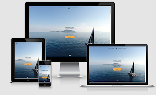
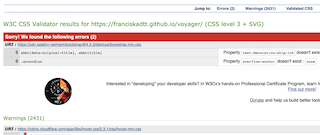
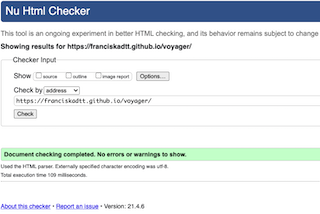
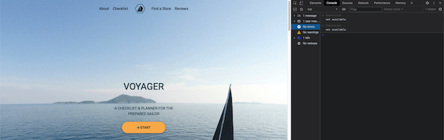

# Voyager Website - Testing details

[Main README.md file](README.md)

[View live version of website via GitHub Pages](https://franciskadtt.github.io/voyager/)
## Testing user stories from the UX section
1. As a beginner to an intermediate sailor, I want to have guidance on what to pack for a day/overnight trip.
    - In the Checklist section there is a comprehensive list of items divided into different categories so the user is guided on what to pack. The user does not have to think of items themselves or research for items.
        - [View image of List of categories and items](assets/wireframes/user-story-1.png)
2. As a sailor, I want to make sure that I have remembered all the items to be packed by using a checklist.
    - The "Checklist" section has a list of items underneath each other and has a function built-in, where the user can "check-off" items from the list like they would in real life.
        - [View image of Checklist item](assets/wireframes/user-story-2.png)
3. As a user if I have packed an item on the list, I want to be able to check it off the list.
    - The user can click/tap on the "Check" button and it will remove the item from the "Items to Pack" list. The item will then move to the "Already Packed" section.
        - [View image of item in Already packed list](assets/wireframes/user-story-3.png)
4. As a sailor, I want to be able to list items I still need to buy. 
    - The user can click/tap on the "Buy" button and it will remove the item from the "Items to Pack" list and add it to the "To Buy" list where the user can easily see the items they need to buy.
        - [View image of item in To Buy list](assets/wireframes/user-story-4.png)
5. As a user if I have bought an item on the list, I want to be able to check it off the list.
    - In the "To Buy" section the items appear with a "Check" button so that if the item is then bought and packed, it can be clicked/tapped. The item will then move to the "Already Packed" section.
        - [View image of item in To Buy list with check button](assets/wireframes/user-story-5.png)
6. As a sailor, I want to be able to find a sailing store to buy items (either physical or online).
    - In the "Find a Store" section, the user has a choice of online or physical stores that sell sailing and marine items. 
        - [View image of store options](assets/wireframes/user-story-6.png)
    - In the "Online Stores" section, the user can simply click/tap on the store link and they will be taken to the store's website.
        - [View image of online store links](assets/wireframes/user-story-7.png)
    - In the "Physical Stores" section, the user can interact with the Map and there are pre-populated markers to indicate physical store in the area. If the user click/tap on the map marker, the store's information will appear as well as a link to their website.
        - [View image of interactive physical store map with markers and store information cards](assets/wireframes/user-story-8.png)
7. As a user, I want to be able to see reviews from other users.
    - In the Review Section, the user can view the feedback of the website tool in a carousel of testimonials from other users.
        - [View image of interactive user review carousel](assets/wireframes/user-story-9.png)
8. As a user, I want to be able to share my feedback regarding the checklist
    - The user can fill in the feedback form to give suggestions or feedback on the website tool.
        - [View image of feedback form](assets/wireframes/user-story-10.png)
9. As a user, I want to be able to follow or connect with the creator of the site on social media.
    - The user can click/tap on the social links which will take them to the creator's social media sites.
        - [View image of social media links in footer](assets/wireframes/user-story-11.png)

##  Testing and Validation of website
### [TestProject](https://testproject.io/)
To test website functionailites.
* **Result**
    1. Carousel for reviews does not work.
    2. Link to LinkedIn showed a 404 error.
* **Fix** 
    1. Update link for Linkedin.
    2. Fix the carousel by using bootstrap code.

### [Link Checker](https://validator.w3.org/checklink)
To check that all links are working and not broken.
* **Result**
    1. Link to LinkedIn showed 404 error.
    2. Broken fragments for landing section link.
    3. Broken link in head of index.hmtl for google fonts.
* **Fix**  
    1. Update link for Linkedin.
    2. Add id for landing section.
    3. Remove broken link in head.

### Lighthouse (Google dev tool)
To test the accessibility and performance of the website.
* **Result**
    1. Links to cross-origin destinations are unsafe.
    2. Slow loading time for the website.
    3. No Accessibility for anchor tags.
    4. Heading elements are not in a sequentially-descending order.
* **Fix** 
    1. Add rel="noopener noreferrer" to any external links to improve performance and prevent security vulnerabilities.
    2. Optimise images with TinyPNG.
    3. Add aria-label to anchor tags.
    4. Change the heading element tag to be in descending order.
- Further tests were done by using Lighthouse open source, the performance result was good, no issues were shown about timing, interactions, accesibility and SEO.
- Final version: 

### [Responsinator](http://www.responsinator.com/)
To test the responsiveness of the live website and functionalities on different size mobile devices.
* **Result**
    1. Carousel issue on some wider /landscape devices.
* **Fix** 
    1. Fix the carousel by using bootstrap code to ensure responsiveness on all devices.
- Final version: [To view site on Responsinator ](https://www.responsinator.com/?url=https%3A%2F%2Ffranciskadtt.github.io%2Fvoyager%2F)

### [Am I Responsive](http://ami.responsivedesign.is/)
To view images of the website on different devices.
* **Result**
    - The responsiveness of the website looks good.
- Final version: 

### [JSHint](https://jshint.com/)
To detect errors and potential problems in your JavaScript code.
1. Main script file:
* **Result**
    1. Issues with not declaring variables.
    2. Issues variable name.
* **Fix** 
    1. Ensure the variable is declared correctly.
    2. Fix variable name.
2. Email script file:
* **Result**
    1. Issues with semicolons that were missing.
* **Fix** 
    1. Add semicolons in the correct places.
3. Maps script file:
* **Result**
    1. Warning: Do not use 'new' for side effects.
* **Fix** 
    1. As I got this line of code from [Google](https://developers.google.com/maps/documentation/javascript/marker-clustering), I did not remove the word "new".

- Final version: no errors for https://franciskadtt.github.io/voyager/) if add /*jshint esversion: 6 */ at top of code so that JSHint does not raise unnecessary warnings for ECMAScript 6 features.

### [W3C CSS validation](https://jigsaw.w3.org/css-validator/)
To validate the CCS code of the project.
* **Result**
    1. Error: left is not an align-items value.
    2. Warning: Same colour background and border for check button.
    3. Warning: Same colour background and border for the buy button.
    4. Warning: Same colour background and border for the add-own button.
    5. Warning: Same colour background and border for store links.
    6. Warning: Same colour background and border for the store-info button.
    7. Warning: unknown vendors for transition style.
    8. Error: cannot have href for button element (Clear the decks button)
* **Fix** 
    1. Fix Error: remove align-items.
    2. Fix Warnings for background and border colour: Remove border colour.
    3. Fix Warning for unknown vendors: Remove vendor extensions.
    4. Fix Error: change element to anchor tag for to clear storage.
- Final version: only errors and warnings left are from 3rd party apps (no errors or warnings for https://franciskadtt.github.io/voyager/) 
- 

### [W3C Markup Validation](https://validator.w3.org/)
To validate the HTML code of the project.
* **Result**
    1. Warning: The type attribute is unnecessary for JavaScript resources (2 scripts)
    2. Error: Attribute for an href not allowed on element button at this point.
    3. Error: An img element must have an alt attribute, except under certain conditions. (3 images)
    4. Error: The value for the attribute of the label element must be the ID of a non-hidden form control.
    5. Error: The aria-describedby attribute must point to an element in the same document.
* **Fix** 
    1. Fix warning 1 = Remove 'type' attribute from scripts
    2. Fix warning 2 = Change 'button' tag to 'input' tag
    3. Add "alt" attributes to 3 carousel images
    4. Add identical for and id elements for label and input fields
    5. Remove aria-describedby attribute
- Final version: no errors or warnings for https://franciskadtt.github.io/voyager/)
- 

### Google Dev Tool 
To check for errors in JavaScript code
* **Result**
1. Error was showing up relating to "if (currentPackedItems.includes(elementText))"  in line 14 saying that currentPackedItems was not declared yet. This only occured if the page is opened for the first time and no data was selected previously
* **Fix** 
1. Becuase it there was no value yet (nothing stored), an error was returned. The fix was: Add "[]" so that error is not returned if no data stored
- Final version: no errors or warnings for https://franciskadtt.github.io/voyager/)
- 

## Manual testing of all elements and functionality on every page
1.  Landing Section
    1. Go to the "Landing" page from a desktop.
    2. Change the screen size from desktop to mobile to verify that the navigation bar is responsive and switches from the in-line menu to the burger icon dropdown menu at the appropriate place.
    3. Reduce the width of the window to confirm that the image has the correct focus for mobile and tablet.
    4. Hover over the start button and verify if you hover over it, a shadow appears as expected.
    5. Click on the Start button which scrolls down to the Checklist section.
    6. Hover over the down arrow and verify if you hover over it, it moves as expected.
    7. Click on the down arrow which scrolls down to the About section.
    8. Review all functionality and responsiveness on my mobile phone and tablet.
2. About Section
    1. Click on the scroll up button which scrolls up to the Landing Section.
    2. Review all functionality and responsiveness on my mobile phone and tablet.
3. Checklist Section
    1. Reduce the width of the window to confirm that the textboxes move below each other for mobile and tablet view.
    2. Type in "Voyage Name" text box = Text displays.
    3. Type in "Departure Point" text box = Text displays.
    4. Click on "Show me the Ropes" = Modal opens.
    5. Click on "x" in modal = Modal closes.
    6. Click on all "check" buttons in each category = All items move to the "Already packed" list.
    7. Click on all "buy" buttons in each category = All items move to "To Buy list".
    8. Click on the "check" buttons for items in the "To Buy" list so that items move to the "Already Packed" list. I expected this to work but encountered a **bug** that duplicated the item in the "Already Packed" list. I found the issue in a javascript function that targeted an icon and not the button itself and corrected the function to target the button with the correct class.
    9. Click on the "Own Items" category and type in text in the input field = Text displays.
    10. Click on the "+" button = New item is added to the "Own list" category.
    11. Click on the delete button in the "Own List" category = Item is deleted from that list.
    12. Click on the "check" and buy" buttons if the user adds their own item in the "Own Items" List. Encountered a **bug** here where the item did not move to the "Already packed" or "To Buy" section. My mentor helped me to identify the issue. The function for creating the new own list item was targeting the wrong class and the list items should be the parent of the div in which the new items are created. In the HTML structure for the Wrapper for own list items also needed to just have a ul element and not be wrapped in a div. The last fix was to correct the event listeners 
    13. Click on "Clear the Decks" to refresh page = Page resets and removes all typed info inboxes and resets checklist. Note: the local storage function and clear function does not work as expected for iOS 14 as it has additional restrictions on third-party content. It is therefore recommended to use the website non-iOS 14 devices if that functionality is to be used. This has been a general issue for Safari, for more info see (https://stackoverflow.com/questions/30048009/html5-localstorage-setitem-is-not-working-on-ios-8-safari-mobile).
    14. Click on the scroll up button = Scrolls up to the Landing Section.
    15. Review all functionality and responsiveness on my mobile phone and tablet.
4. Store Section
    1. Hover over the store item link = Verify if you hover over it, the colour change works as expected.
    2. Click on each store link and verify that the correct store site is opened in a new tab.
    3. Refresh the page several times to ensure Google maps is displaying correctly with the correct map markers.
    4. Click on each map marker and verify that on click the store information card displays.
    5. Resize page to verify the store information card displays below the Google Map for mobile and tablet.
    6. Review all functionality and responsiveness on my mobile phone and tablet.
5. Review Section
    1. Click on carousel arrows to move back and forth and verify it slides as expected.
    2. Try to submit the empty form and verify that an error message about the required fields appears
    3. Try to submit the form with an invalid email address and verify that a relevant error message appears
    4.  Reduce and expand the width of the window to verify that the form display behaves and centres the way expected and that it looks good on all device widths.
    5. Review all functionality and responsiveness on my mobile phone and tablet.
6. Footer Section
    1. Verify all social media links go to social media pages - issue with the LinkedIn link.
    2. Review all functionality and responsiveness on my mobile phone and tablet.
7. 404 Error page
    1. Verify go back button goes back to home page. I encountered a bug where for the live site the button did not want to work. I then changed the button element to an anchor element and ensure the href was "index.html".

## Further testing: 
1. Asked fellow students, friends and family to look at the site on their devices and report any issues they find.
2. Viewed my website on several devices, no further issues found.
3. Review all functionality and responsiveness on different desktop browsers and the website displayed correctly in all browsers including Safari, Chrome, Edge, Internet Explorer, Firefox and Opera browsers.